# Tarea-03---Docker-01
- 1.- Descarga la imagen de Alpine sin arrancarla y comprueba que la tienes. Fija la versión: no uses latest. Escoge una versión, de las disponibles en docker hub.
> Primero ir a https://hub.docker.com/_/alpine y escoger cualquier version que no sea lastest (o sea la ultima), yo escogi la 3.20
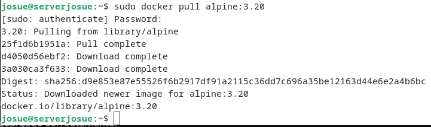
> Comprobacion:
> 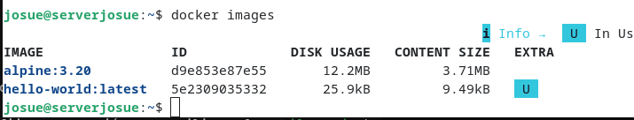
- 2.-Crea un contenedor sin nombre y sin arrancarlo. ¿En qué estado queda? ¿Qué nombre le ha puesto Docker?
>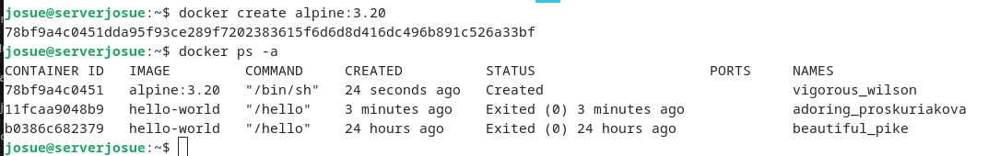
> Pone que su estado es "Created" y de nombre "vigorous_wilson"
- 3.-Crea y arranca dam_alp1 con una shell. ¿Qué opciones necesitas para poder escribir dentro?
> 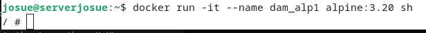
> las opciones son -i: que mantiene abierto el flujo de entrada estandar lo que permite escribir con el teclado, y -t: asigna una terminal virtual lo que da una interfaz grafica a la consola
- 4.-Desde dentro, mira qué IP tiene y si puede hacer ping a google.com.
>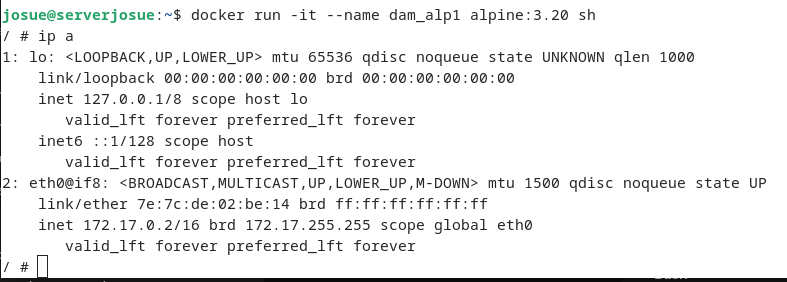
> 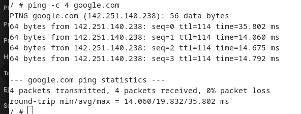
> la ip es 172.17.0.2 y si hace ping con google.com
- 5.-Deja dam_alp1 funcionando sin pararlo y crea dam_alp2 igual. Con los dos en marcha, haz ping de uno a otro: por IP y por nombre. Explica cada resultado.
>Para salir primero tengo que presionar ctrl+P y ctrl+Q y luego creo el 2
> 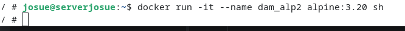
> 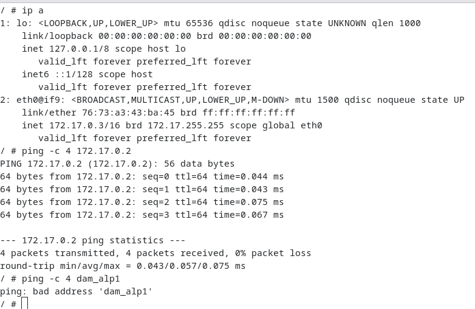
> Por ip me hace ping pero con el nombre da error de bad address
- 6.-Con los dos en marcha, averigua cuánta memoria consumen. ¿Hay un comando de Docker para eso?
>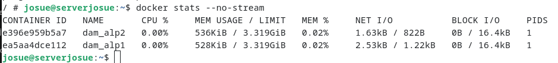
> usando este comando se puede ver cuanta memoria consumen
- 7.-Sal con exit. ¿Qué les ha pasado? Repite el comando anterior: ¿qué ves ahora y por qué?
> 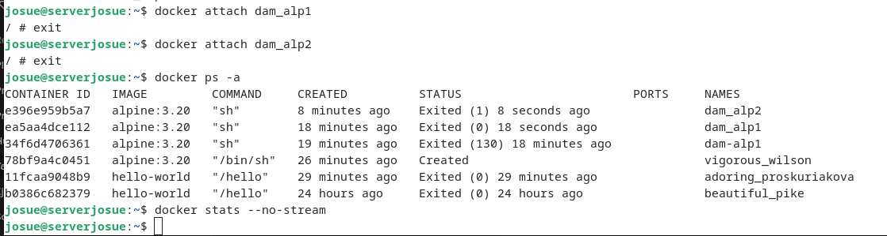
> Sali y me sali con status "EXITED" y cuando uso el comando anterior no me aparece nada 
- 8.-¿Cuánto disco has ocupado? Distingue imágenes de contenedores.
> 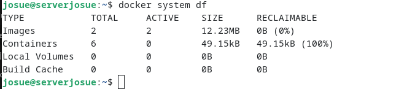
> 
> solo me ocupo esto